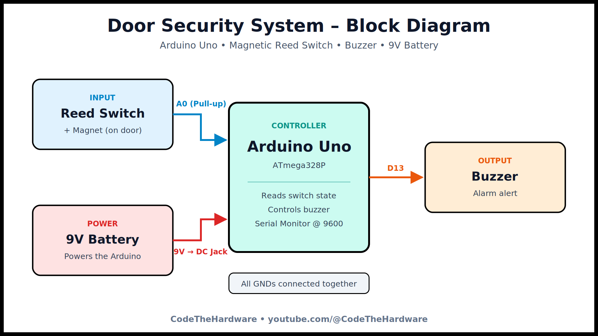

# Door Security System using Arduino Uno

A simple door security alarm using a **magnetic reed switch** and a **buzzer** with **Arduino Uno**.
The reed switch detects the door state, and the buzzer sounds an alert. The switch state is also shown on the Serial Monitor.

## 🎥 Video Tutorial
Watch the full tutorial on my YouTube channel: [CodeTheHardware](https://www.youtube.com/@CodeTheHardware)

## 🧰 Components Required
- Arduino Uno
- Magnetic reed switch (with magnet)
- Buzzer
- 9V battery (with DC jack connector)
- Jumper wires
- Breadboard

## 🔌 Connections
| Component    | Arduino Uno    |
|--------------|----------------|
| Reed switch  | A0 and GND     |
| Buzzer (+)   | D13            |
| Buzzer (−)   | GND            |
| 9V battery   | DC barrel jack |

> The reed switch uses Arduino's internal pull-up resistor (`INPUT_PULLUP`), so no external resistor is needed.

## ⚙️ How It Works
- **Door closed (magnet near switch):** A0 reads HIGH → buzzer OFF
- **Door opened (magnet moves away):** A0 reads LOW → buzzer ON 🔔

## ▶️ How to Use
1. Click the green **Code** button → **Download ZIP**, then extract it
2. Open `Door_Security_System_Reed_Switch_Buzzer.ino` in Arduino IDE
3. If Arduino IDE asks to create a folder for the sketch, click **OK**
4. Select **Tools → Board → Arduino Uno** and the correct COM port
5. Click **Upload**
6. Open **Serial Monitor** at **9600 baud** to see the switch state

## 🔋 Power Note
A 9V battery works for demos but drains quickly. For long-term use, power the Arduino with a 9V adapter or a USB power bank.

## 📜 License
This project is licensed under the [MIT License](LICENSE).

---
⭐ If this project helped you, star this repo and subscribe to [CodeTheHardware](https://www.youtube.com/@CodeTheHardware) for more embedded projects!
